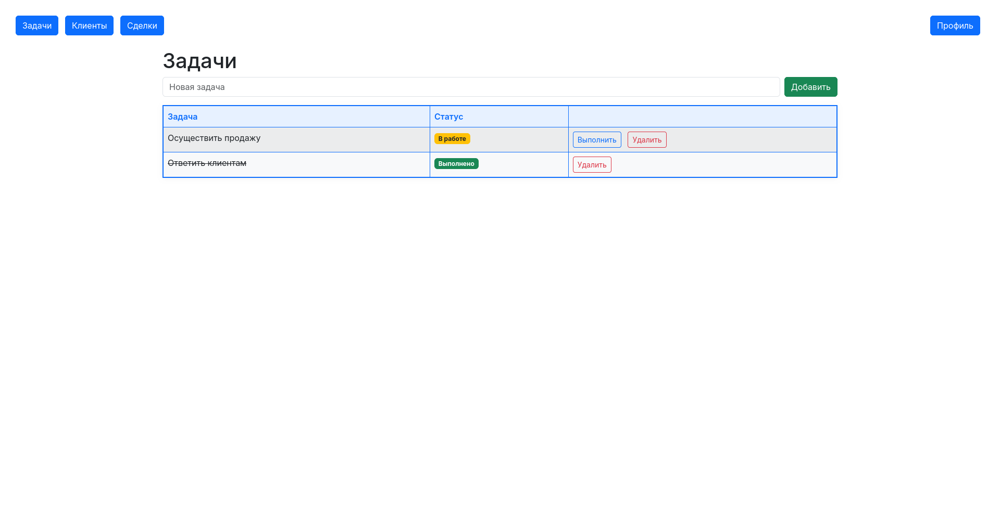

# CRM & Task Manager

**Современная CRM-система и таск-менеджер для малого бизнеса и команд**

## О проекте

Универсальный CRM и Task Manager на Django/PostgreSQL. Всё для работы с клиентами и сделками.

Этот проект — не просто CRM, а готовое решение для управления клиентами, сделками и задачами. Он создан для малого бизнеса, стартапов и команд, которым важно быстро внедрить эффективный инструмент для роста продаж и контроля процессов.

- **Технологии:** Django, PostgreSQL, Bootstrap 5
- **UI:** Современный адаптивный дизайн, модальные окна, быстрый доступ к основным функциям
- **Безопасность:** Авторизация (логин), защита всех страниц, профиль пользователя

## Возможности

- **Клиенты:** Ведение базы клиентов, быстрый поиск и фильтрация
- **Сделки:** Управление сделками, история по каждому клиенту, статус выполнения
- **Задачи:** Постановка и контроль задач, фильтрация по статусу и исполнителю
- **Профиль пользователя:** История сделок, статистика, персональный доступ
- **Удобство:** Модальные окна для добавления/редактирования, современный navbar, адаптивная верстка
- **Поиск и фильтры:** Мгновенный поиск по клиентам и сделкам, фильтрация по статусу и другим параметрам
- **Валюты:** Выбор валюты для сделок (₽, $, €)
- **Чистый код:** Готов для портфолио и продакшена

## Почему этот проект?

- **Быстрый старт:** Простая установка, подробная документация
- **Гибкость:** Легко доработать под свои нужды
- **Современный стек:** Только актуальные технологии и лучшие практики Django
- **Презентабельность:** Чистый код, стильный интерфейс, готов к демонстрации работодателю или заказчику

## Скриншоты





## Установка и запуск

1. Клонируйте репозиторий:
   ```bash
   git clone https://github.com/kilanchix/django-crm-tasks.git
   cd django-crm-tasks
   ```
2. Установите зависимости:
   ```bash
   pip install -r requirements.txt
   ```
3. Настройте базу данных PostgreSQL (см. `settings.py`)
4. Примените миграции:
   ```bash
   python manage.py migrate
   ```
5. Создайте суперпользователя:
   ```bash
   python manage.py createsuperuser
   ```
6. Запустите сервер:
   ```bash
   python manage.py runserver 8001
   ```
7. Перейдите на [http://localhost:8001/](http://localhost:8001/)

## Демо-доступ

- **Логин:** admin
- **Пароль:** admin

---
